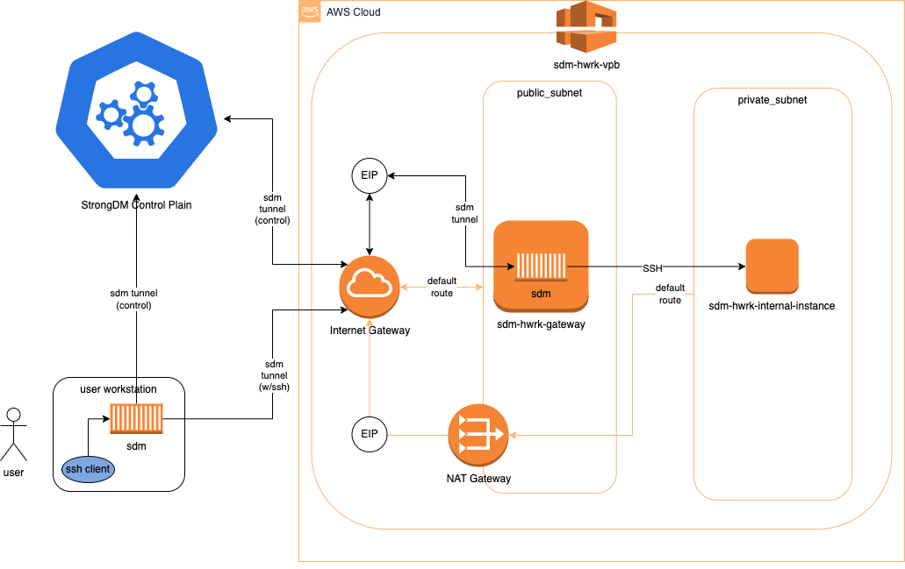

# SDM-HWRK (StrongDM Homework)

Repo with solution for infrastructure task during recruitment to StrongDM.

## Requirements

### Functional

- Deploy an SSH server that is not exposed publicly to the internet. 

- Make the SSH server available via StrongDM

- Following this guide, deploy a publicly available gateway that is able to reach your privately deployed SSH Server

- The target SSH Server should NOT be in the same subnet at the publicly accessible Gateway

- The team will ask qualifying questions about every piece of the stack, so it is recommended to use the technology you're familiar with

- Add your SSH Server, ensure it's been granted to yourself and Hutch in the org, and verify you can connect to it through the strongDM client

### Non-functional
- This SDM Org is shared among multiple StrongDM candidates, so please do not touch any other gateways, ssh servers, or other resources that you didn't create!

- The team will ask qualifying questions about every piece of the stack, so it is recommended to use the technology you're familiar with

- For inspiration here are some technologies we work with regularly: EC2, Docker, k8s, AWS, Fargate, NLB

- BONUS POINTS: Deploy with automation: Terraform, Ansible, and/or Chef.

## Solution
### Architecture Decisions
1. Use AWS for the infrastrucure
- Alternatives:
- - Use physical servers (or VMWare ESX environment)
- - Use local virtualization: Docker, VMWare Fusion, VirtualBox, KVM, Hyper-V, Paralles, etc.
- - Use GCP, Azure etc.
- Rationale:
- - I have no on-prem 
- - Local virtualization comes with licencing, performance and networking problems
- - StrongDM seems to be focused around AWS
- - Requirements refer to terms used in AWS
- - I know AWS best
2. Use own AWS lab istead of one provided by StrongDM
- Alternatives:
- - Use StringDM lab
- Rationale:
- - I have full admin access to it (no access problems)
- - I can use API keys (In StrondM lab I have no IAM access, and generation fo keys could be difficult or even not prossible)
- - Cost of basic infrastucture would not be high
3. Take IaaS aproach
- Alternatives:
- - Provision through console
- - Provision through CLI
- Rationale:
- - IaaS can allow gradual and controlled solution development
- - It is repeatable
- - It was preffered in task definition
4. Use Terrafrom
- Alternatives:
- - Use CloudFormation
- - Use Ansible, Chef 
- Rationale:
- - StrongDM has terraform provider (sdm) for managing control plane
- - There are examples of terrafrom code
- - Chef/Ansible would require much more scripting/development 
5. Split solution into several Terraform templates
- Alternatives:
- - Keep everyting in single main.tf
- - Use modules
- Rationale:
- - Better logic
- - Gradual development
- - Modules are not required for one-off project (they could make sense for reppeated ones with well established framework)
6. SDM Gateway's SSH port should not be exposed on the Internet or  intenally without proper SDM-enforced control
- Alternatives:
- - SDM Gateway is avaialble on the Internet
- - SDM Gateway is available on internal VPC network
- Rationale:
- - SDM Gateway is crucial to security of solution
- - Direct SSH seessions could not be logged adn monitored
- - Exposing SSH would not be in line with Zero Trust principles
7. Use SSH TrustedUserCAKeys for server resources.
- Alternatives:
- - Use traditonal SSH key-pairs
- Rationale:
- - SSH keys created during control-plane server resource creation cannot be used in instance definiton, as instance IP is known only after instance is created and cannot be used for resource creation (loop).
- - In case of gateway, EIP could be used for server resource creation, but then there is problem with restrictive gateway SG for SSH

## Solution diagram

